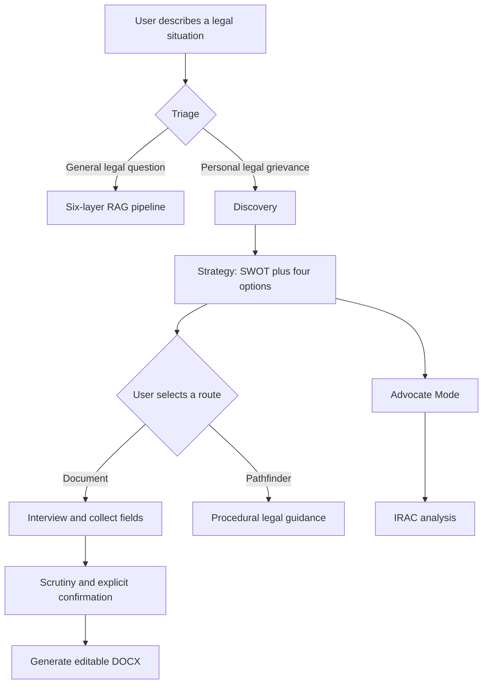
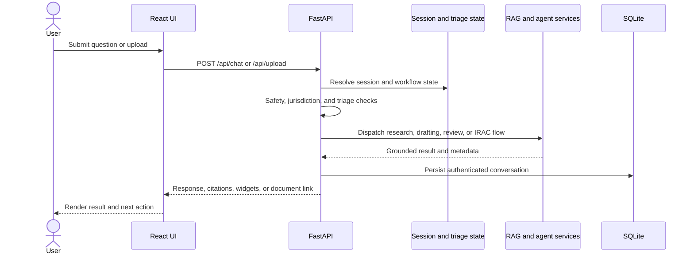
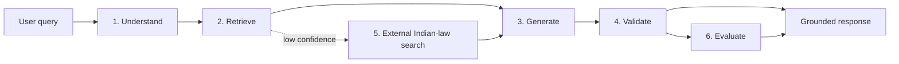

# JuriSense

### Indian legal intelligence for research, reasoning, and document workflows

JuriSense is an AI-assisted legal research and drafting platform built for Indian-law use cases. It combines retrieval-augmented generation, hybrid search, specialist agents, structured legal reasoning, document generation, and persistent conversations in one application.

> **Legal notice:** JuriSense is a research and drafting aid, not a law firm or a substitute for qualified legal advice. Verify every generated response, citation, deadline, and document with an appropriate legal professional before relying on it.

## What it does

- **Research:** Ask natural-language questions about Indian law and receive retrieval-grounded answers with source context.
- **Virtual Counsel:** Move through a controlled `Discovery -> Strategy -> Execution` workflow for fact gathering and next-step planning.
- **Advocate Mode:** Request an IRAC-style analysis covering facts, issues, rules, application, counterarguments, and conclusion.
- **Drafting:** Collect the required facts conversationally, run pre-draft scrutiny, and generate editable `.docx` documents.
- **Contract evaluation:** Upload PDF, DOCX, or TXT files for structured review.
- **Persistent workspaces:** Create accounts, save conversations, and return to prior research sessions.
- **Indian-law awareness:** Surface updates when older references such as IPC or CrPC need to be considered alongside their newer statutory counterparts.

## Core workflows

### 1. Research and Q&A

The six-layer pipeline understands a query, retrieves relevant legal material, generates a response, validates the result, falls back to external Indian-law sources when appropriate, and evaluates confidence.

### 2. Virtual Counsel

Virtual Counsel is a Python-enforced state machine rather than a single prompt:

```text
Discovery  ->  Strategy  ->  Execution
             /                     \
     document drafting       procedural guidance
```

- **Discovery:** Clarifies the situation, evidence, timeline, emotional state, and desired outcome. The intake is capped at three turns.
- **Strategy:** Produces a SWOT-style assessment and exactly four validated options.
- **Execution:** Routes the selected option to document drafting or step-by-step procedural guidance. Advocate Mode is available for deeper IRAC analysis.



### 3. Document drafting

Drafting is intentionally gated: the user selects a drafting route, answers the interview questions, reviews scrutiny findings, and explicitly confirms generation. Supported workflows include legal notices, cheque-bounce notices, employment notices, FIR complaints, and rental agreements, with a dynamic fallback for other document types.

## Architecture

```text
React + Vite frontend
          |
          v
FastAPI API server
    |       |       |
  Auth   Workflows  Uploads
    |       |       |
 SQLite  Agents   Documents
          |
          v
    Six-layer RAG pipeline
          |
  Hybrid retrieval -> Groq LLM -> validation -> confidence
```

### Request lifecycle



### Six-layer RAG pipeline



| Layer | Responsibility | Implementation |
| --- | --- | --- |
| 1 | Query understanding and legal-domain classification | `layer1_understanding.py` |
| 2 | Hybrid retrieval and reranking | ChromaDB, Sentence Transformers, BM25, CrossEncoder |
| 3 | Response generation and legal reasoning | Groq via `layer3_reasoning.py` |
| 4 | Fact checking and citation validation | `layer4_validation.py` |
| 5 | External Indian-law fallback search | DuckDuckGo and Indian legal sources |
| 6 | Confidence scoring and legal insights | `layer6_evaluator.py`, knowledge graph |

### Data and persistence

- `data/raw_data/` contains the legal source JSON files.
- `data/vector_db/` contains the ChromaDB index used for retrieval.
- `backend/saulgpt.db` stores users, conversations, and messages in SQLite.
- The default ChromaDB collection is `saulgpt_indian_laws`.

## Technology

| Area | Tools |
| --- | --- |
| Frontend | React 18, Vite, Axios, jsPDF |
| Backend | Python, FastAPI, Uvicorn, Pydantic |
| AI | Groq, LangChain, Sentence Transformers, spaCy |
| Retrieval | ChromaDB, BM25, CrossEncoder reranking |
| Documents | PyMuPDF, python-docx |
| Auth and storage | JWT, bcrypt, SQLite |

## Quick start on Windows

### Prerequisites

- Python 3.11 recommended
- Node.js 18 or later
- npm
- A Groq API key

### Option A: one-click launch

For a fresh checkout, run:

```powershell
scripts\setup.bat
start.vbs
```

The launcher starts the backend on `http://localhost:8000`, starts the frontend on `http://localhost:5173`, and opens the application in a browser.

### Option B: manual setup

From the repository root:

```powershell
py -3.11 -m venv .venv
.\.venv\Scripts\Activate.ps1
python -m pip install --upgrade pip setuptools wheel
python -m pip install -r backend\requirements.txt
cd jurisense-ui
npm install
cd ..
```

Create `.env` in the repository root, next to this README:

```env
GROQ_API_KEY=your_groq_api_key_here
```

Then start the services in two terminals.

**Terminal 1: backend**

```powershell
.\.venv\Scripts\Activate.ps1
cd backend
python api_server.py
```

**Terminal 2: frontend**

```powershell
cd jurisense-ui
npm run dev
```

Open [http://localhost:5173](http://localhost:5173). FastAPI documentation is available at [http://localhost:8000/docs](http://localhost:8000/docs).

## Vector index

The repository includes a prebuilt index under `data/vector_db/`. If it is missing or needs to be rebuilt, run this from the repository root:

```powershell
.\.venv\Scripts\Activate.ps1
python backend\02_chunk_and_embed.py
```

The first run may download the `all-MiniLM-L6-v2` embedding model and can take several minutes.

## Project layout

```text
JuriSense/
├── backend/
│   ├── api_server.py              # FastAPI entry point
│   ├── pipeline_orchestrator.py   # Conversation memory and RAG dispatch
│   ├── discovery_agent.py         # Virtual Counsel discovery
│   ├── strategy_agent.py          # Validated strategy options
│   ├── irac_agent.py              # Advocate Mode analysis
│   ├── interview_state.py         # Drafting interview state machine
│   ├── document_generator.py      # .docx generation
│   ├── scrutiny_agent.py          # Pre-draft review
│   ├── layer1_*.py ... layer6_*.py # RAG pipeline layers
│   ├── agents/                    # Research, drafting, review, and triage agents
│   ├── prompts/                   # Centralized prompt templates
│   └── tests/                     # Backend tests
├── data/
│   ├── raw_data/                  # Indian legal source data
│   └── vector_db/                 # ChromaDB persistence
├── jurisense-ui/
│   └── src/                       # React application
├── docs/                          # Architecture and setup notes
├── scripts/                      # Windows setup and launch scripts
├── .env.example
└── README.md
```

## API surface

The primary endpoints are:

| Method | Endpoint | Purpose |
| --- | --- | --- |
| `POST` | `/api/chat` | Main chat, triage, RAG, drafting, and Advocate Mode flow |
| `POST` | `/api/chat/stream` | SSE-streaming chat response |
| `POST` | `/api/upload` | Evaluate a PDF, DOCX, or TXT contract |
| `GET` | `/api/health` | Check backend availability |
| `GET` | `/api/conversations` | List authenticated conversations |
| `POST` | `/api/conversations` | Create a conversation |
| `GET` | `/api/conversations/{id}` | Load a conversation and its messages |
| `DELETE` | `/api/conversations/{id}` | Delete a conversation |
| `POST` | `/api/conversations/migrate` | Import a guest session after sign-in |
| `DELETE` | `/api/history/{session_id}` | Clear session history |
| `DELETE` | `/api/draft/state/{session_id}` | Cancel and clear drafting state |
| `GET` | `/api/document/{session_id}` | Download a generated `.docx` |
| `GET` | `/docs` | Interactive FastAPI documentation |

Authentication endpoints include `/api/auth/signup`, `/api/auth/login`, and `/api/auth/me`.

Before normal triage, the backend also applies safety and jurisdiction checks. Crisis signals such as active violence, confinement, or self-harm are routed to emergency guidance instead of being sent through the legal reasoning pipeline.

## Verification

Build the frontend:

```powershell
cd jurisense-ui
npm run build
```

Run the RAG evaluation suite:

```powershell
cd ..
.\.venv\Scripts\python.exe backend\eval_pipeline.py
```

Run backend tests:

```powershell
.\.venv\Scripts\python.exe -m pytest backend\tests
```

## Documentation

- [Architecture](docs/ARCHITECTURE.md)
- [Setup guide](docs/SETUP_GUIDE.md)
- [API reference](docs/API_REFERENCE.md)
- [Feature guide](docs/FEATURES.md)

## Security and responsible use

- Keep `.env` and API keys out of version control.
- Treat generated legal content as a draft until it has been reviewed.
- Confirm statute names, amendments, limitation periods, jurisdiction, and filing requirements independently.
- Do not upload confidential documents unless your deployment and data-handling requirements permit it.

## License

See [LICENSE](LICENSE) for the project license.
